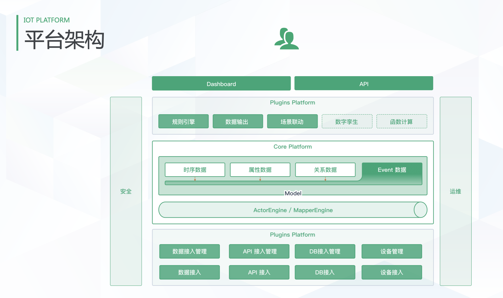

# keel-cli

----

## What is keel-cli

The Keel CLI allows you to setup Keel on your local dev machine or on a Kubernetes cluster, launches and manages Keel instances.

## Demo Environment

TODO

## Features

The goal of this tutorial is to demonstrate the basic usage of the most popular tKeel features. You will learn how to:
 - Install keel: similar to dapr install, install relevant programs;
 - Install the plug-in: similar to dapr run, start the program and register with the plugin manager;
 - User list: lists the user list;
 - Plug in list: lists the plug-in list;
 - Stop plug-in: similar to dapr stop;
 - Uninstall keel: similar to dapr uninstall, uninstall the program.

## Architecture

The diagram below shows key system components and interfaces they provide. Let’s walk through them.

## Latest Release

TODO

## Installation

TODO

### Quick Start

TODO

## Contributing, Support, Discussion, and Community
We :heart: your contribution. The [community](docs/community/README.md) walks you through how to get started contributing keel-cli. The [development guide](docs/community/contribution/design-proposal-template.md) explains how to set up development environment.

Please submit any keel-cli bugs, issues, and feature requests to [keel-cli GitHub Issue](https://github.com/tkeel-io/keel-cli/issues)

